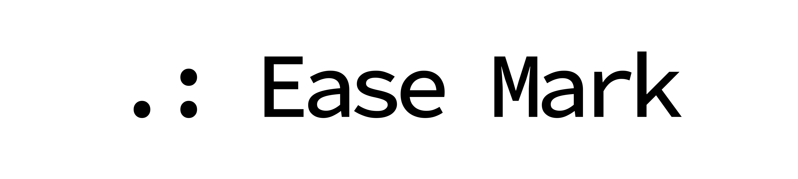

[peam-url]: https://www.pmqueiroz.dev/about



<div align="center">

<samp>this project is result of hell boredom coupled with a desire to code a little; I know it's non-sense at all</samp> 

</div>

## Instalation

Create a file in the root named `.npmrc` containing this config:

```
@pmqueiroz:registry=https://npm.pkg.github.com 
```
And then run install:

```sh
npm install @pmqueiroz/ease-mark
yarn add @pmqueiroz/ease-mark
pnpm add @pmqueiroz/ease-mark
```

## Api Reference

### Parse

Parse a string source ease-mark

```ts
import { parse } from '@pmqueiroz/ease-mark'

parse('.: Hello word') // <h3>Hello World<h3/>
```

Using as tagged template function

```ts
import { parse } from '@pmqueiroz/ease-mark'

const hello = (name: string) => 'Hello ' + name

parse`.: ${() => hello('World')}` // <h3>Hello World<h3/>
```

## Syntax

### Headings

| Ease | HTML | Rendered Output |
| -----|------|-----------------|
| `. Heading level 1` | `<h1>Heading level 1</h1>` | <h1>Heading level 1</h1>|
| `: Heading level 2` | `<h2>Heading level 2</h2>` | <h2>Heading level 2</h2>|
| `.: Heading level 3` | `<h3>Heading level 3</h3>` | <h3>Heading level 3</h3>|
| `:: Heading level 4` | `<h4>Heading level 4</h4>` | <h4>Heading level 4</h4>|
| `.:: Heading level 5` | `<h5>Heading level 5</h5>` | <h5>Heading level 5</h5>|
| `::: Heading level 6` | `<h6>Heading level 6</h6>` | <h6>Heading level 6</h6>|

### Paragraphs

To create paragraphs, use a blank line to separate one or more lines of text.

| Ease | HTML | Rendered Output |
| -----|------|-----------------|
| `This is a paragraph` | `<p>This is a paragraph</p>` | <p>This is a paragraph</p>|

### Code

#### Inline

not implemented yet.   

#### Fenced

To create a code block, use three backticks (```) before and after the code. Add the language after the first set of backticks for proper syntax highlighting. Example:

```
    ```js
          const hello = 'Hello World'
    ```
```
The rendered output looks like this:

```js
   const hello = 'Hello World'
```
<div align="center">

<samp>Made by [**Peam**][peam-url]</samp> 

</div>
